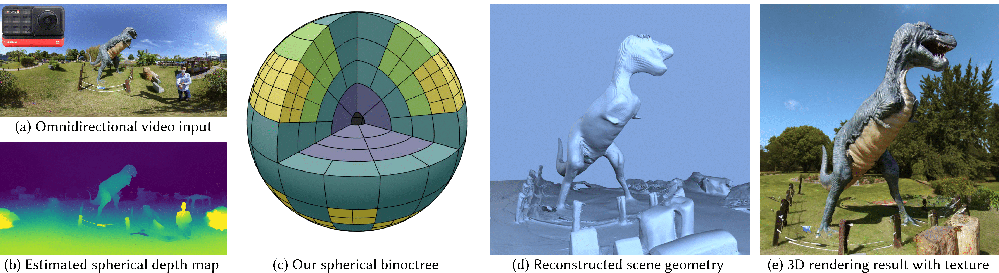

# Egocentric Scene Reconstruction from an Omnidirectional Video

### [Project page](http://vclab.kaist.ac.kr/siggraph22p2.html) | [Paper](http://vclab.kaist.ac.kr/TBA.html) | [Presentation](http://vclab.kaist.ac.kr/TBA.html) | [360 RGBD Dataset](http://vclab.kaist.ac.kr/TBA.html)

[Hyeonjoong Jang](http://vclab.kaist.ac.kr/hjjang/),
[Andreas Meuleman](https://ameuleman.github.io),
[Dahyun Kang](http://vclab.kaist.ac.kr/dhkang/index.html),
[Donggun Kim](http://vclab.kaist.ac.kr/dgkim/index.html),
[Christian Richardt](https://richardt.name/),
[Min H. Kim](http://vclab.kaist.ac.kr/minhkim/)
<br>
KAIST, University of Bath
<br>


In this repository, we provide the code for the paper 'Egocentric Scene Reconstruction from an Omnidirectional Video'
, reviewed and presented at **SIGGRAPH 2022**.


## Tested Environments
- OS: Ubuntu 21.10
- Graphic card: TITAN RTX
- Cuda toolkit version: 11.1
- NVIDIA Driver Version: 495.44
- python: 3.9.7
- torch version: 1.9.0+cu111
- CMake: >3.17


## Installation
### Dependencies
Install dependencies by running the following code.
```
sudo apt-get install libgles2-mesa-dev
sudo apt-get install libboost-all-dev
sudo apt install libomp-dev
sudo apt-get install python-opengl
sudo apt-get install libeigen3-dev
```

### Conda Environments
Create a conda environment by running the following code.
```
conda env create -f environment.yml
conda activate egocentric
pip3 install torch==1.9.0+cu111 torchvision==0.10.0+cu111 torchaudio==0.9.0 -f https://download.pytorch.org/whl/torch_stable.html
pip install scipy
pip install sklearn
```

### RAFT & Dual Marching Cube
First, download and install OpenCV (https://opencv.org/) and Cuda toolkit 11.1 (https://developer.nvidia.com/cuda-11.1.0-download-archive)

Our Binoctree implementation is based on RAFT (https://github.com/princeton-vl/RAFT) and dmc (https://github.com/planaria/dmc).

Clone the repositories and build by running the following code.

It will clone the repositories and replace modified codes with files in `delta` folder.
```
sh setup.sh
```

## How To Run Demo

```
python main.py --config demo/config/demo.json
```
Our code is controlled by values specified in a json file.
We provide a sample json file `demo/config/demo.json`.


### Explanations of each step.
Step 0: Mask Generation
 - It will create a window and show the input video repeatedly.
 - Drag and drop inside the window several times to mask out unwanted regions such as a photographer.
 - Press 's' to end the step.

Step 1: Pose Estimation (SLAM)
 - It will run OpenVSLAM to estimate camera poses.
 - Since OpenVSLAM is not available anymore (https://github.com/xdspacelab/openvslam/wiki/Termination-of-the-release), we provide `map.msg`, `traj.csv` files in `demo/input_video/sponza` folder which are output of this step.

Step 2: Depth Estimation
 - It will create a `demo/depth/sponza_depth` folder and save depth maps (inverse depth).

Step 3: Weight calculation
 - It will create a `demo/depth/sponza_weight` folder and save weight maps.

Step 4: Mesh Generation
 - It will create a `mesh` folder and save `.stl` and `voxel_center.obj` files.
 - `voxel_center.obj` visualizes the centers of each voxel (binoctree node) with two colors: red for positive SDF values, blue for negative SDF values.

Step 5: Texture Mapping
 - It will create an OpenGL window to visualize a textured mesh.
 - Press 'P' to stop camera movement and manually move the camera.
 - Drag with mouse left button to rotate viewing direction.
 - Click with mouse right button to reset the viewing direction.
 - Translate the camera with '1', '3', '4', '6', '2', '8' keys to move forward, backward, left, right, downward, and upward.
 - Press 'C' to capture and save an image.
 - Press 'D' to visualize depth.

### Parameters
 - `step`:"2345" will make the program run step 2, 3, 4, and 5 in sequence.
 - `video_name`:"sponza" points the name of the folder that has `video.mp4` in it.
 - `base_pth`: finetuned RAFT checkpoint path.
 - `depth_scale`: Scale of depth map image size compared to the input video.
 - `sample_ratio`: Every `sample_ratio` frame of the video will be used for depth estimation.
 - `second_neighbor_size`: Number of neighbor frames will be used for depth estimation.
 - `second_neighbor_interval`: Frame intervals between the neighbor frames.
 - `mask_radius`: The ratio (percentage of width) of mask region near the baseline axis. [0.1,0.2] should be fine.
 - `solid_angle`: The solid-angle threshold for binoctree subdivision stop condition. T<sub>solid</sub> in our paper.
 - `frame_interval`: Every `frame_interval` depth map will be used for mesh generation (TSDF accumulation).
 - `min_depth`: r<sub>near</sub> in our paper.
 - `max_depth`: r<sub>far</sub> in our paper.
 - `sky_depth_threshold`: Depth values that are larger than `sky_depth_threshold` will be ignored.
 - `truncation`: TSDF truncation slope. e<sub>m</sub> in our paper.
 - `truncation_offset`: TSDF truncation offset e<sub>n</sub> in our paper.
 - `truncation_change`: Additional variable for adaptive truncation.
 - `weight_trunc_std`: Additional weight for adaptive truncation. Smaller value will give more weights for closer depth estimates.
 - `node_sample_interval`: Every `node_sample_interval` pixel values of depth maps will be used for mesh generation (TSDF accumulation). Value of 1 will use all depth estimates.
 - `min_sdf_cnt`: Only voxels (binoctree nodes) that was updated more than `min_sdf_cnt` will be used for mesh generation (dual marching cubes). From 0 to 5 should be OK for most cases. 
 - `sclae_simple`, `scale_bbox`, `spline_num`, `rendering_num`: Parameters of camera movement for visualization.
 - `key_frame_num`: Number of representative input frames that will be used for texture mapping.
 - `result_rendering_record`: Set 1 to record a video.
 - `result_rendering_record_one_cycle_only`: Record once only.
 - `blend_closest_C_frames`: Variable for development. Always set 1.
 - `result_rendering_frame_step`: Every `result_rendering_frame_step` frames will be used for rendering.
 - `texture_frame_idx_list_step`: Every `texture_frame_idx_list_step` input frames will be used for texture mapping
 - `stl_name`: Saving name of output mesh (`stl_name`.stl).
 - `input_trajectory_name`: The name of the input trajectory file (`input_trajectory_name`.csv).
 - `input_depth_dir_postfix`: The suffix of the name of the folder that contains depth maps.
 - `result_rendering_trajectory_name`: Camera trajectory for visualization.
 - `texture_merge_take_max`, `texture_merge_topK`, `texture_merge_topKoutlier_colorthreshold`: Additional parameters for texture mapping.
 - `texture_map_max_sizeK`: A parameter of texture map size. If you face not-enough-memory, reduce this value.
 - `result_rendering_fov`: Rendering field of view.
 - `result_rendering_h`: Rendering window height.
 - `result_rendering_w`: Rendering window width.
 - `cube_side`: The size of cubemap used for texture mapping.
 - `result_rendering_initial_rotation`: Rendering initial camera rotation matrix.


## License

Hyeonjoong Jang, Andreas Meuleman, Dahyun Kang, Donggun Kim, and Min H. Kim have developed this software and related documentation (the "Software"); confidential use in source form of the Software, without modification, is permitted provided that the following conditions are met:

Neither the name of the copyright holder nor the names of any contributors may be used to endorse or promote products derived from the Software without specific prior written permission.

The use of the software is for Non-Commercial Purposes only. As used in this Agreement, “Non-Commercial Purpose” means for the purpose of education or research in a non-commercial organization only. “Non-Commercial Purpose” excludes, without limitation, any use of the Software for, as part of, or in any way in connection with a product (including software) or service which is sold, offered for sale, licensed, leased, published, loaned or rented. If you require a license for a use excluded by this agreement, please email [minhkim@kaist.ac.kr]([mailto:minhkim@kaist.ac.kr]).

Warranty: KAIST-VCLAB MAKES NO REPRESENTATIONS OR WARRANTIES ABOUT THE SUITABILITY OF THE SOFTWARE, EITHER EXPRESS OR IMPLIED, INCLUDING BUT NOT LIMITED TO THE IMPLIED WARRANTIES OF MERCHANTABILITY, FITNESS FOR A PARTICULAR PURPOSE, OR NON-INFRINGEMENT. KAIST-VCLAB SHALL NOT BE LIABLE FOR ANY DAMAGES SUFFERED BY LICENSEE AS A RESULT OF USING, MODIFYING OR DISTRIBUTING THIS SOFTWARE OR ITS DERIVATIVES.

Please refer to [license](LICENSE) for more details.

## Acknowledgement

This project uses the following open-source libraries and repositories, 
please consider citing them if you use related functionalities:
- [OpenCV](https://github.com/opencv/opencv)
- [Dual Marching Cubes](https://github.com/planaria/dmc)
- [RAFT](https://github.com/princeton-vl/RAFT)
- [NeHe](https://github.com/gamedev-net/nehe-opengl)


## BibTex
```BibTeX
@Article{jang2022egocentric,
 author = {Hyeonjoong Jang, Andreas Meuleman, Dahyun Kang, Donggun Kim, Christian Richardt, and Min H. Kim},
    title = {Egocentric Scene Reconstruction from an Omnidirectional Video},
    journal = {ACM Transactions on Graphics (Proc. SIGGRAPH 2022)},
    month = {August},
    year = {2022},
    volume = {XX},
    number = {X},
        doi = "XXX",
        url = "XXX"
}
```
